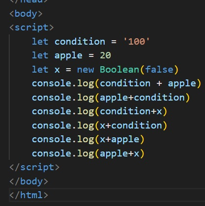
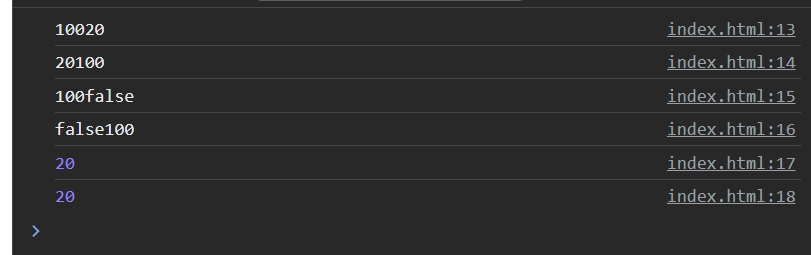
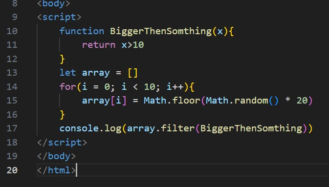
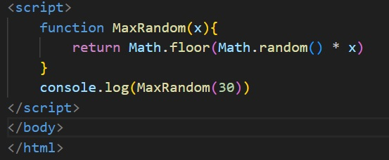
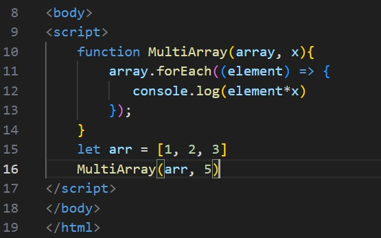
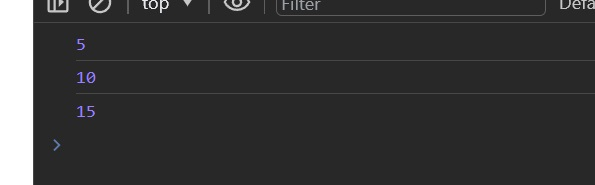
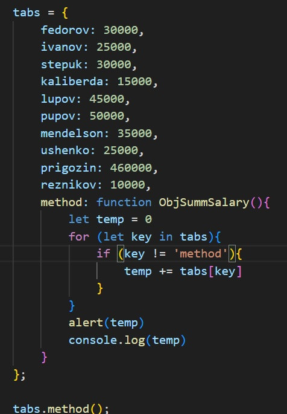
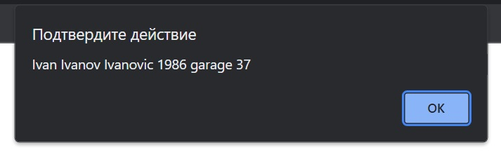
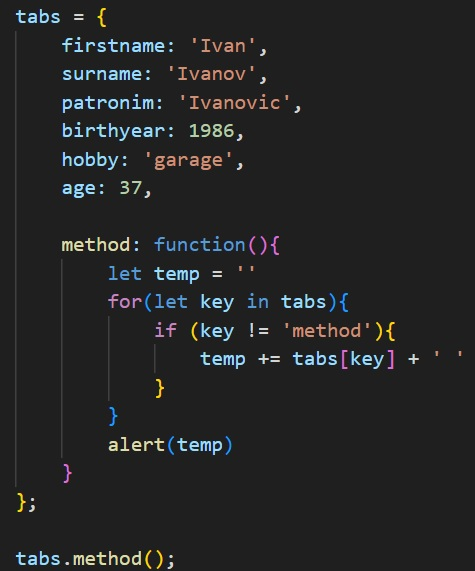
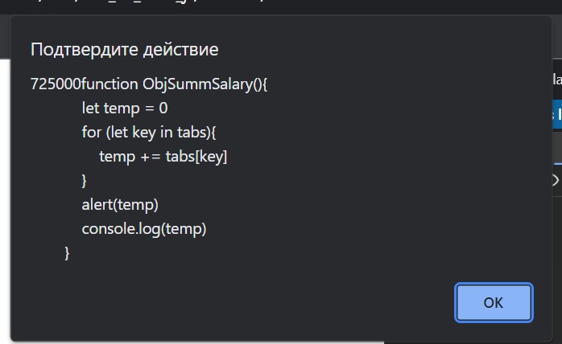

# ЛАБОРАТОРНАЯ РАБОТА 6

Здесь я приведу ответы на первые вопросы, а потом просто будут скрины кода потому что так было проще :cat:

## ОТВЕТЫ НА ВОПРОСЫ

1. Через оператор let
2. const определяет константы, которые нельзя менять после определения
var определяет простую, глобальную, внеблочную переменную. Очень плохо короче и её трогать низя.
let переменные имеют блочную видимость, а ещё их нельзя объявить повторно. Вот её трогать очень даже нужно.
3. Alert выводит нам бесячее сообщение в браузере, в котором можно что то обустроить
4. Для дебага и всякой внутрянки, я думаю

### Задание 2

И ответ в консольке:

### Задание 3

И в консольке:

### Задание 4

Первое:

  

Второе:

  

### Задание 5

Первое:

  

Второе:

!  [img](img/5.2.2.jpg)

На этом все :nail_care:

#### А ВОТ И НЕ ВСЕ

JS это язык настоящих гениев, не каждому дано понять всю суть работы в этом великом языке, да, жаль что не многие нынче понимают как работает JS, мало образованных людей в наше время!!!

